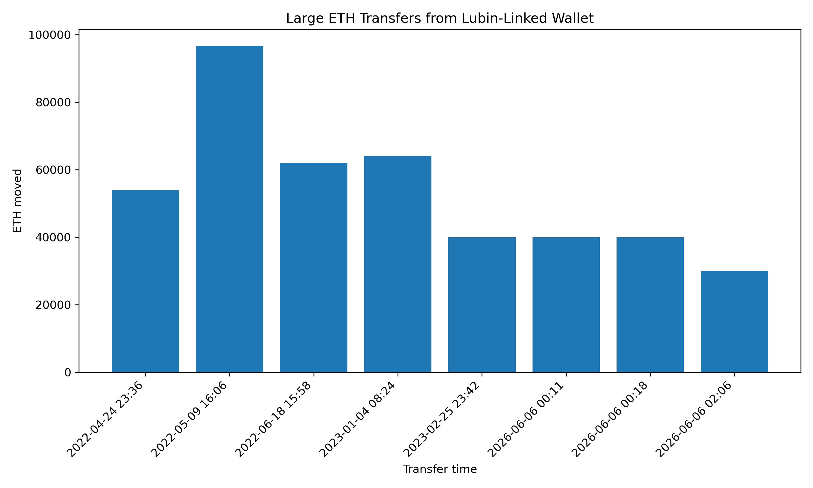
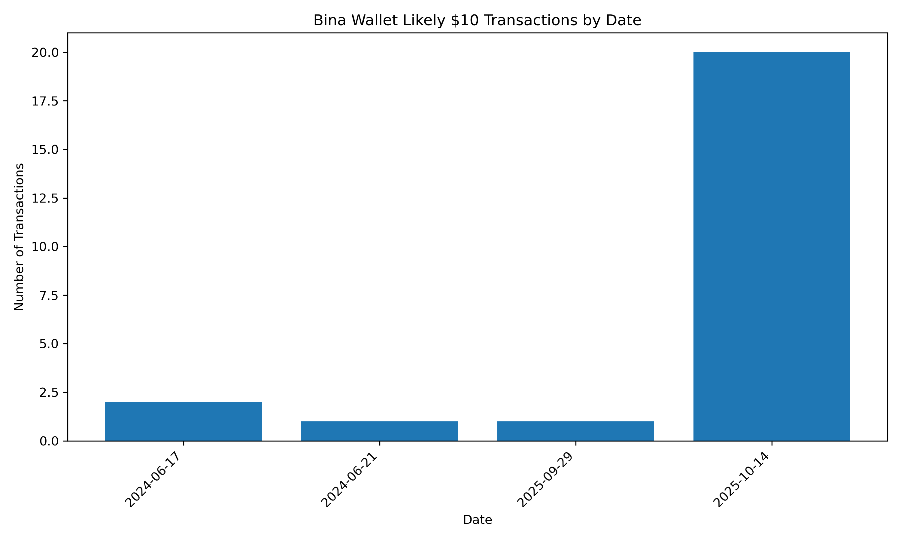
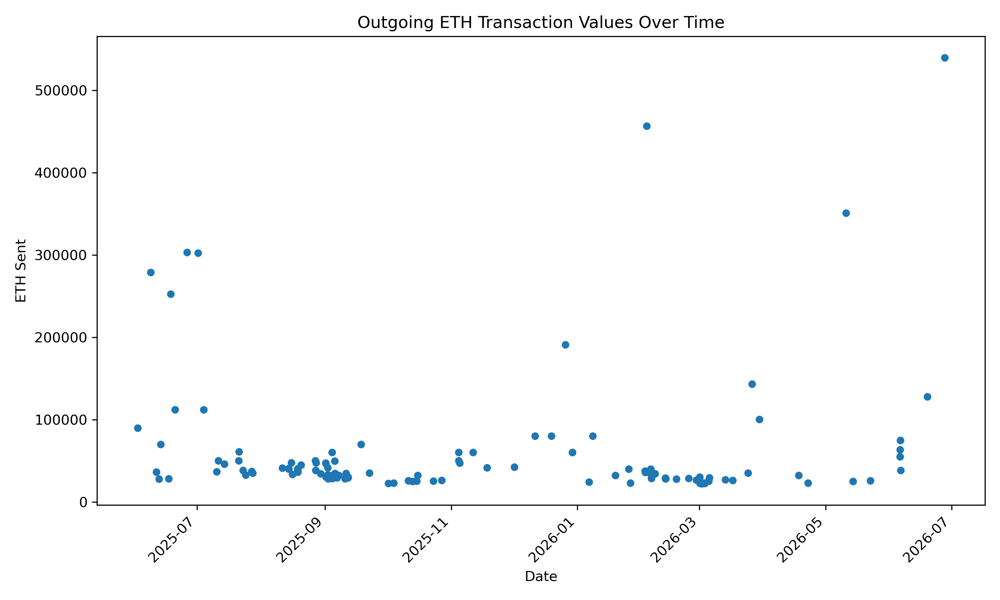
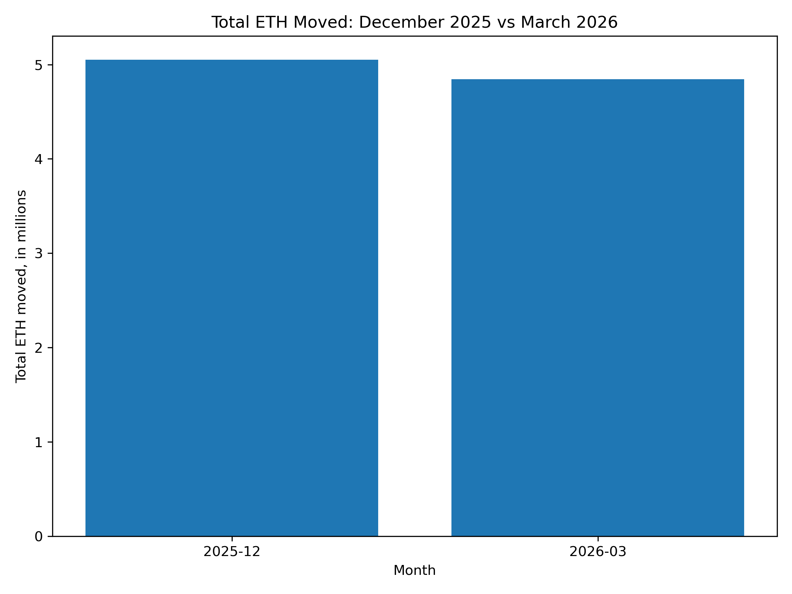
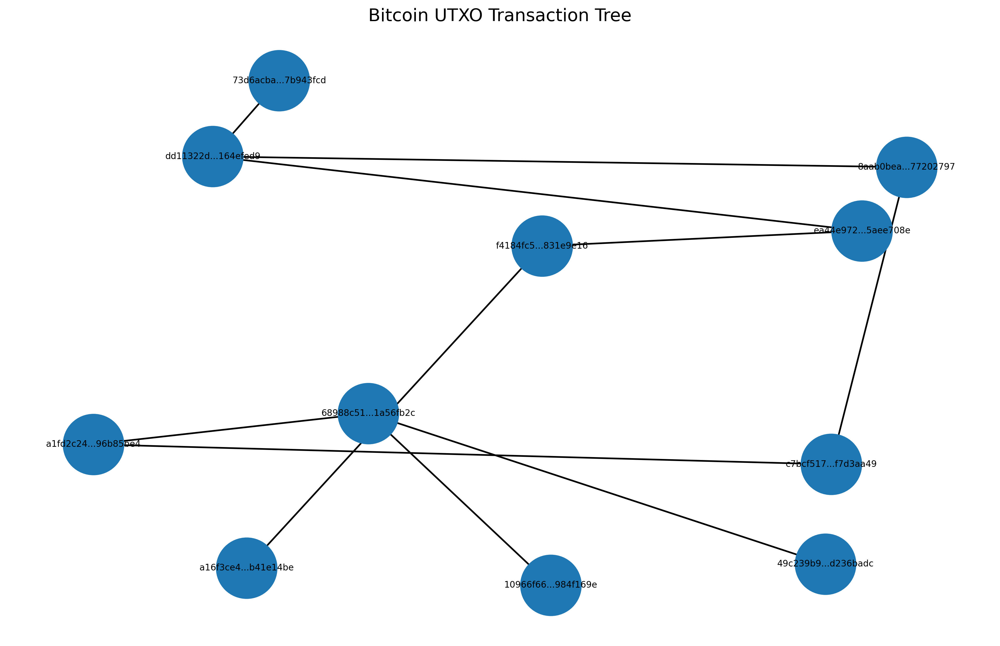

# Ledger Trails

### Ethereum Transfer Patterns and Bitcoin UTXO Tracing

**Author:** Arnav Nanda
**Research Mentor:** Dr. Bina Ramamurthy
**Project:** NSF Blockchain Research Project

---

## Abstract

This project analyzes public Ethereum and Bitcoin ledger data through five smaller case studies. The Ethereum work focuses on high-value ETH transfers, wallet activity, exchange/custody wallet behavior, and a December versus March comparison. The Bitcoin work focuses on tracing transactions using the UTXO model, where outputs from one transaction can be spent in later transactions. I used Etherscan, Google BigQuery, PostgreSQL, Python, pandas, matplotlib, and NetworkX to collect, filter, summarize, and visualize blockchain data. Overall, this project shows how public ledger records can reveal transaction patterns while also showing the limits of smaller-scale analysis.

---

## Project Overview

This repository contains my summer blockchain research project with Dr. Bina Ramamurthy.

The goal of this project was to take public blockchain data and turn it into smaller, understandable analyses. Instead of trying to process an entire blockchain at full scale, I focused on a group of specific questions that could each be answered with a query, script, graph, and short write-up.

The project covers both Ethereum and Bitcoin. The Ethereum tasks are mostly account-based, meaning they look at wallet addresses, senders, receivers, and ETH transfer values. The Bitcoin task is different because Bitcoin uses the UTXO model, where the focus is on following transaction outputs as they are spent into later transactions.

Together, these tasks show a few different ways blockchain ledger data can be used: investigating large transfers, finding wallet-level patterns, studying exchange/custody wallet activity, comparing transaction activity across months, and tracing Bitcoin transaction paths.

---

## Tools Used

* Python
* pandas
* matplotlib
* NetworkX
* Etherscan API
* Google BigQuery
* PostgreSQL / psql
* Blockstream Bitcoin API
* GitHub

---

## Analytics Items

The project is organized around these main analysis tasks:

1. Joe Lubin / MakerDAO-related ETH transfer trace
2. Wallet address analysis for likely $10 ETH transactions
3. Binance 14 wallet transaction distribution
4. Seasonal Ethereum comparison between December 2025 and March 2026
5. Bitcoin UTXO transaction tree trace
6. High-value Ethereum transfer pattern analysis

---

## 1. Joe Lubin / MakerDAO-Related ETH Transfer Trace

For this task, I looked into a Lubin-linked Ethereum wallet that was connected to a large MakerDAO / Maker Vault-related ETH movement.

**Wallet analyzed:**

```text
0x1b3cb81e51011b549d78bf720b0d924ac763a7c2
```

I used Etherscan transaction data that had been imported into PostgreSQL. I filtered for outgoing ETH transfers from this wallet where the value was at least 30,000 ETH.

The main finding was that the large June 6th movement did not appear as one single transaction. Instead, it showed up as three separate outgoing transfers:

* 40,000 ETH
* 40,000 ETH
* 30,000 ETH

Together, those transfers add up to about **110,000 ETH**.

This was useful because my earlier search only found the two 40,000 ETH transfers. Lowering the threshold to 30,000 ETH helped show the full split-transfer pattern.



**Limitation:** This analysis only looks at normal ETH transfers. A deeper version would trace the receiving addresses further and look more closely at internal transactions, Maker Vault activity, and related smart contract interactions.

---

## 2. Wallet Address Analysis: Likely $10 ETH Transactions

For this task, I analyzed Dr. Ramamurthy’s Ethereum wallet and looked for outgoing transactions that were likely around the $10 range.

**Wallet analyzed:**

```text
0x3e6937bb87A66E3A4DbE5488A4863f5b29674cC3
```

I used the Etherscan API because this task focused on one wallet address. The script collected normal Ethereum transactions for the wallet, filtered for outgoing ETH transactions, and then searched for small transfers.

Since blockchain transaction data gives the value in ETH instead of historical USD, I used an approximate first-pass range:

```text
0.0020 ETH to 0.0030 ETH
```

The analysis found **24 likely $10-range outgoing transactions**. Most of them happened on **October 14, 2025**, with 20 of the 24 filtered transactions occurring on that date.

During the project discussion, Dr. Ramamurthy confirmed that October 14th lined up with a lecture date during her Fulbright scholarship in Austria. That made this task a useful example of how on-chain data can sometimes connect back to a real-world event.



**Limitation:** This is not an exact USD calculation yet. It is an ETH-based estimate. A stronger version would use historical ETH/USD price data to check whether each transaction was actually between $9.50 and $10.50 at the time it happened.

---

## 3. Binance 14 Wallet Transaction Distribution

For this task, I analyzed the outgoing transaction amounts of a high-activity Ethereum wallet labeled as Binance 14.

**Wallet analyzed:**

```text
0x28c6c06298d514db089934071355e5743bf21d60
```

This address appeared repeatedly in the monthly top 100 normal ETH transfer dataset, so it was a good example of exchange/custody wallet activity.

The dataset used here contains the 100 largest normal ETH transfers for each month from June 2025 through June 2026. Since the range covers 13 months, the dataset has 1,300 total rows.

Within this dataset, Binance 14 appeared as the sender in **125 transactions**.

Summary of Binance 14 outgoing transactions in the monthly top 100 dataset:

* Minimum: about 22,157 ETH
* Maximum: about 539,596 ETH
* Average: about 60,191 ETH
* Median: about 35,091 ETH
* Total: over 7.5 million ETH

The main pattern was that the average was much higher than the median. This means a smaller number of very large transfers pulled the average upward. It also supports the idea that exchange and custody wallets can dominate many of the largest normal ETH transfers.



**Limitation:** This is not the full transaction history of Binance 14. It only includes transactions where Binance 14 appeared inside the monthly top 100 normal ETH transfer dataset.

---

## 4. Seasonal Ethereum Comparison: December vs. March

For this task, I compared high-value Ethereum transaction activity in December 2025 and March 2026.

The goal was not to prove a full market trend. It was a first-pass comparison of high-value ETH movement during two selected months.

I used the monthly top 100 normal ETH transfer dataset and filtered for:

* December 2025
* March 2026

I then compared total ETH moved, average transaction size, and largest transaction size.

**December 2025**

* 100 transactions
* about 5.05 million ETH moved
* average transaction size of about 50,501 ETH
* largest transaction of about 190,778 ETH

**March 2026**

* 100 transactions
* about 4.85 million ETH moved
* average transaction size of about 48,453 ETH
* largest transaction of about 294,183 ETH

December had slightly higher total ETH moved and a slightly higher average transaction size. March had the largest single transaction.



**Limitation:** This is only a first-pass comparison using high-value normal ETH transfers. It does not include all Ethereum transactions, ERC-20 transfers, internal transactions, DeFi contract activity, or ETH/USD price movement.

---

## 5. Bitcoin UTXO Transaction Tree Trace

For this task, I worked with Bitcoin instead of Ethereum. This was different from the Ethereum tasks because Bitcoin uses the UTXO model.

In Ethereum, it is natural to look at a wallet address and track incoming and outgoing transactions. In Bitcoin, transactions create outputs, and those outputs can later be spent by future transactions. Because of that, Bitcoin tracing is more about following outputs than following account balances.

I first tested the Bitcoin genesis transaction:

```text
4a5e1e4baab89f3a32518a88c31bc87f618f76673e2cc77ab2127b7afdeda33b
```

The script found that the genesis transaction had one 50 BTC output, but it did not have a normal forward spending path. I documented this as a special case instead of forcing the graph to continue.

After that, I used an early spendable Bitcoin transaction to demonstrate the UTXO trace:

```text
f4184fc596403b9d638783cf57adfe4c75c605f6356fbc91338530e9831e9e16
```

The script traced the path forward by checking transaction outputs, seeing whether each output was spent, and then following the transaction that spent the output.

The practical trace reached **hop 7**, which means **8 total levels** because the hop count starts at 0.

In the graph:

* each node is a Bitcoin transaction
* each arrow shows an output being spent into a later transaction
* H0 is the starting transaction
* H1 is the transaction that spent an output from H0
* H2 is the transaction that spent an output from H1



**Limitation:** This is a simplified UTXO trace. It follows a readable path instead of expanding every possible branch. A larger version could trace multiple branches and create a more complete transaction tree.

---

## Why Public Ledger Analysis Matters

One reason blockchain data is interesting is that the ledger is public. Wallet addresses do not automatically tell the full story, but the transaction records can still be searched, filtered, grouped, and traced. That makes public ledger data useful for studying large transfers, wallet behavior, exchange activity, and unusual transaction patterns.

A recent example discussed during this project was the AlphaRaccoon / Polymarket case involving Michele Spagnuolo, a Google employee who was accused of using confidential company information to make prediction-market trades. My project is much smaller in scale, but it follows the same general idea: public ledger data becomes more useful when it is organized, filtered, and visualized.

That was the main goal of this project. I was not trying to solve one giant blockchain problem all at once. Instead, I worked through smaller case studies that show different ways blockchain data can be analyzed, from Ethereum wallet activity to Bitcoin UTXO tracing.

---

## Limitations

This project uses smaller, focused datasets instead of full-chain archival infrastructure.

Some analyses rely on Etherscan API results, BigQuery exports, or top-100 transaction samples rather than complete blockchain histories. The Ethereum analyses mainly focus on normal ETH transfers, so they do not fully capture ERC-20 token transfers, internal transactions, DeFi contract state changes, or historical USD pricing.

The Bitcoin UTXO graph is also simplified. It follows a readable forward path instead of expanding every possible branch.

With larger storage, compute resources, and archival blockchain infrastructure, each analysis could be expanded into a deeper full-chain study.

---

## Summary

This project gave me hands-on experience working with blockchain ledger data from both Ethereum and Bitcoin.

The Ethereum tasks helped me practice wallet-level analysis, SQL filtering, high-value transaction analysis, and visualization. The Bitcoin task helped me understand how different UTXO tracing is from Ethereum account-based analysis.

The main thing I learned is that blockchain analysis depends on choosing the right data source for the question. Wallet-specific questions worked best with Etherscan. Broader Ethereum transaction questions worked better with BigQuery exports and PostgreSQL. Bitcoin tracing required a different approach because it follows transaction outputs instead of account balances.

Overall, these five smaller analyses show how public blockchain data can be used to investigate large transfers, study wallet behavior, compare transaction patterns, and visualize transaction paths.

---

## Repository Structure

```text
NSF-Blockchain-Project/
├── analyses/
│   ├── joe_lubin_makerdao_analysis/
│   ├── bina_wallet_10_dollar_transactions/
│   ├── ethereum_wallet_distribution/
│   ├── seasonal_eth_analysis/
│   └── bitcoin_utxo_tree/
├── scripts/
├── sql/
├── data/
├── README.md
└── STATUS_UPDATES.md
```

## Project Status

First versions of all five analysis tasks are complete. Each task includes a working query or script, summary results, at least one visual, and documentation of the main findings and limitations.

